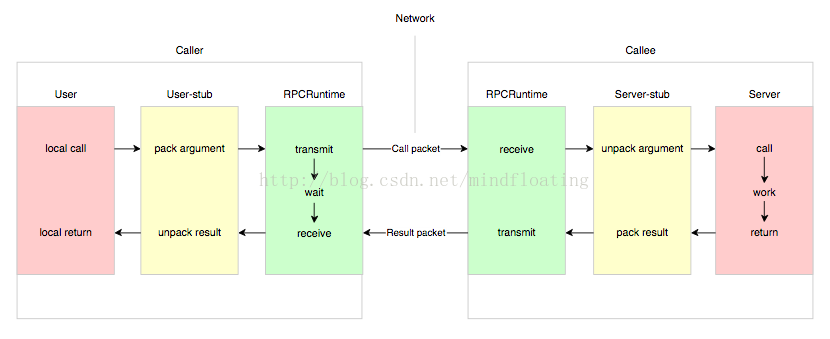
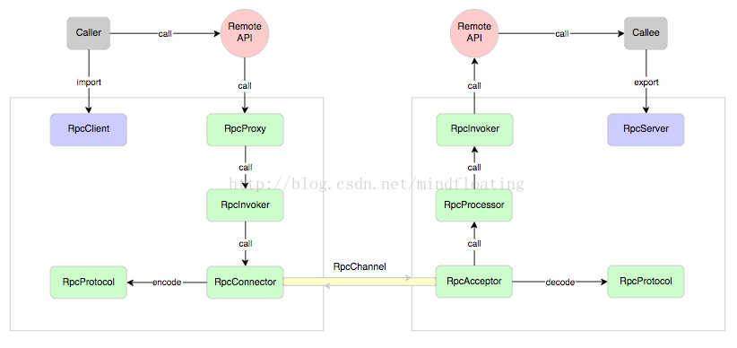
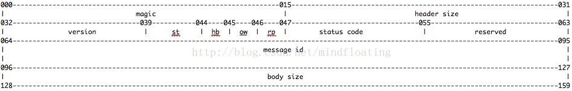

RPC:Remote Procedure Call

RPC 结构:
1. User
2. User-stub
3. RPCRuntime
4. Server-stub
5. Server





1. RpcServer  
   负责导出（export）远程接口  
2. RpcClient  
   负责导入（import）远程接口的代理实现  
3. RpcProxy  
   远程接口的代理实现  
4. RpcInvoker  
   客户方实现：负责编码调用信息和发送调用请求到服务方并等待调用结果返回  
   服务方实现：负责调用服务端接口的具体实现并返回调用结果  
5. RpcProtocol  
   负责协议编/解码  
6. RpcConnector  
   负责维持客户方和服务方的连接通道和发送数据到服务方  
7. RpcAcceptor  
   负责接收客户方请求并返回请求结果  
8. RpcProcessor  
   负责在服务方控制调用过程，包括管理调用线程池、超时时间等  
9. RpcChannel  
   数据传输通道

RPC 服务方通过 RpcServer 去导出（export）远程接口方法，而客户方通过 RpcClient 去引入（import）远程接口方法。客户方像调用本地方法一样去调用远程接口方法，RPC 框架提供接口的代理实现，实际的调用将委托给代理RpcProxy 。代理封装调用信息并将调用转交给RpcInvoker 去实际执行。在客户端的RpcInvoker 通过连接器RpcConnector 去维持与服务端的通道RpcChannel，并使用RpcProtocol 执行协议编码（encode）并将编码后的请求消息通过通道发送给服务方。
RPC 服务端接收器 RpcAcceptor 接收客户端的调用请求，同样使用RpcProtocol 执行协议解码（decode）。解码后的调用信息传递给RpcProcessor 去控制处理调用过程，最后再委托调用给RpcInvoker 去实际执行并返回调用结果。

```java
DemoService demo   = new ...;  
RpcServer   server = new ...;  
server.export(DemoService.class, demo, options);  
// 只导出 DemoService 中签名为 hi(String s) 的方法  
server.export(DemoService.class, demo, "hi", new Class<?>[] { String.class }, options);
```

多态调用
```java
DemoService demo   = new ...;  
DemoService demo2  = new ...;  
RpcServer   server = new ...;  
server.export(DemoService.class, demo, options);  
server.export("demo2", DemoService.class, demo2, options);
```

导入远程接口与客户端代理

导入相对于导出远程接口，客户端代码为了能够发起调用必须要获得远程接口的方法或过程定义。目前，大部分跨语言平台 RPC 框架采用根据 IDL 定义通过 code generator 去生成 stub 代码，这种方式下实际导入的过程就是通过代码生成器在编译期完成的。我所使用过的一些跨语言平台 RPC 框架如 CORBAR、WebService、ICE、Thrift 均是此类方式。
代码生成的方式对跨语言平台 RPC 框架而言是必然的选择，而对于同一语言平台的 RPC 则可以通过共享接口定义来实现。在 java 中导入接口的代码片段可能如下：

```java
RpcClient client = new ...;  
DemoService demo = client.refer(DemoService.class);  
demo.hi("how are you?");  
```

协议编解码：


-- 调用编码 --  
1. 接口方法  
   包括接口名、方法名  
2. 方法参数  
   包括参数类型、参数值  
3. 调用属性  
   包括调用属性信息，例如调用附件隐式参数、调用超时时间等  

-- 返回编码 --  
1. 返回结果  
   接口方法中定义的返回值  
2. 返回码  
   异常返回码  
3. 返回异常信息  
   调用异常信息

-- 消息头 --  
   magic      : 协议魔数，为解码设计  
   header size: 协议头长度，为扩展设计  
   version    : 协议版本，为兼容设计  
   st         : 消息体序列化类型  
   hb         : 心跳消息标记，为长连接传输层心跳设计  
   ow         : 单向消息标记，  
   rp         : 响应消息标记，不置位默认是请求消息  
   status code: 响应消息状态码  
   reserved   : 为字节对齐保留  
   message id : 消息 id  
   body size  : 消息体长度  

-- 消息体 --  
   采用序列化编码，常见有以下格式  
   xml   : 如 webservie soap  
   json  : 如 JSON-RPC  
   binary: 如 thrift; hession; kryo 等

传输服务：

协议编码之后，自然就是需要将编码后的 RPC 请求消息传输到服务方，服务方执行后返回结果消息或确认消息给客户方。RPC 的应用场景实质是一种可靠的请求应答消息流，和 HTTP 类似。因此选择长连接方式的 TCP 协议会更高效，与 HTTP 不同的是在协议层面我们定义了每个消息的唯一 id，因此可以更容易的复用连接。
既然使用长连接，那么第一个问题是到底 client 和 server 之间需要多少根连接？实际上单连接和多连接在使用上没有区别，对于数据传输量较小的应用类型，单连接基本足够。单连接和多连接最大的区别在于，每根连接都有自己私有的发送和接收缓冲区，因此大数据量传输时分散在不同的连接缓冲区会得到更好的吞吐效率。所以，如果你的数据传输量不足以让单连接的缓冲区一直处于饱和状态的话，那么使用多连接并不会产生任何明显的提升，反而会增加连接管理的开销。
连接是由 client 端发起建立并维持。如果 client 和 server 之间是直连的，那么连接一般不会中断（当然物理链路故障除外）。如果 client 和 server 连接经过一些负载中转设备，有可能连接一段时间不活跃时会被这些中间设备中断。为了保持连接有必要定时为每个连接发送心跳数据以维持连接不中断。心跳消息是 RPC 框架库使用的内部消息，在前文协议头结构中也有一个专门的心跳位，就是用来标记心跳消息的，它对业务应用透明。   

执行调用:
client stub 所做的事情仅仅是编码消息并传输给服务方，而真正调用过程发生在服务方。server stub 从前文的结构拆解中我们细分了 RpcProcessor 和 RpcInvoker 两个组件，一个负责控制调用过程，一个负责真正调用。这里我们还是以 java 中实现这两个组件为例来分析下它们到底需要做什么？
java 中实现代码的动态接口调用目前一般通过反射调用。除了原生的 jdk 自带的反射，一些第三方库也提供了性能更优的反射调用，因此 RpcInvoker 就是封装了反射调用的实现细节。
调用过程的控制需要考虑哪些因素，RpcProcessor 需要提供什么样地调用控制服务呢？下面提出几点以启发思考：
1. 效率提升  
   每个请求应该尽快被执行，因此我们不能每请求来再创建线程去执行，需要提供线程池服务。  
2. 资源隔离  
   当我们导出多个远程接口时，如何避免单一接口调用占据所有线程资源，而引发其他接口执行阻塞。  
3. 超时控制  
   当某个接口执行缓慢，而 client 端已经超时放弃等待后，server 端的线程继续执行此时显得毫无意义。  
