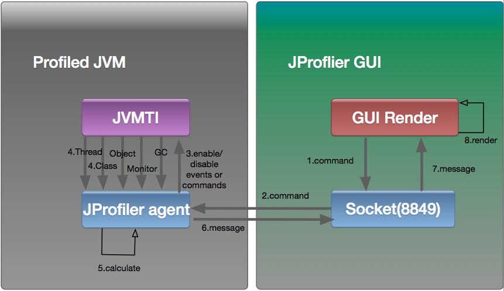

### 分析的数据主要来自于下面俩部分
1. 一部分来自于jvm的分析接口**JVMTI**(JVM Tool Interface)<br>
例如: 对象的生命周期，thread的生命周期等信息
2. 一部分来自于instruments classes(可理解为class的重写,增加JProfiler相关统计功能)<br>
例如：方法执行时间，次数，方法栈等信息

### JProfier采集方式分为两种：
1. Sampling(样本采集)
>类似于样本统计, 每隔一定时间(5ms)将每个线程栈中方法栈中的信息统计出来。优点是对应用影响小(即使你不配置任何Filter, Filter可参考文章第四部分)，缺点是一些数据/特性不能提供(例如:方法的调用次数)

2. Instrumentation
>在class加载之前，JProfier把相关功能代码写入到需要分析的class中，对正在运行的jvm有一定影响。优点: 功能强大，但如果需要分析的class多，那么对应用影响较大，一般配合Filter一起使用。所以一般JRE class和framework的class是在Filter中通常会过滤掉。

### 启动模式:
1. Attach mode
>可直接将本机正在运行的jvm加载JProfiler Agent. 优点是很方便，缺点是一些特性不能支持。如果选择Instrumentation数据采集方式，那么需要花一些额外时间来重写需要分析的class。

2. Profile at startup
>在被分析的jvm启动时，将指定的JProfiler Agent手动加载到该jvm。JProfiler GUI 将收集信息类型和策略等配置信息通过socket发送给JProfiler Agent，收到这些信息后该jvm才会启动。
在被分析的jvm 的启动参数增加下面内容：

3. Prepare for profiling
>被分析的jvm不需要收到JProfiler GUI 的相关配置信息就可以启动。

4. Offline profiling
> 一般用于适用于不能直接调试线上的场景。Offline profiling需要将信息采集内容和策略(一些Trigger, Trigger请参考文章第五部分)打包成一个配置文件(config.xml)，在线上启动该jvm 加载 JProfiler Agent时，加载该xml。那么JProfiler Agent会根据Trigger的类型会生成不同的信息。例如: heap dump; thread dump; method call record等

### 远程监控tomcat

服务器安装配置:
```
JPROFILER_HOME=/opt/jprofiler10.1/bin/linux-x64
export LD_LIBRARY_PATH=$LD_LIBRARY_PATH:$JPROFILER_HOME
```

本地安装配置:
```
1. 下载startup.sh脚本
2. 利用jprofiler生成startup_jprofiler.sh脚本
3. 上传startup_jprofiler.sh至bin下
4. 使用startup_jprofiler.sh启动tomcat
```


可以分析jmap dump出来的文件
