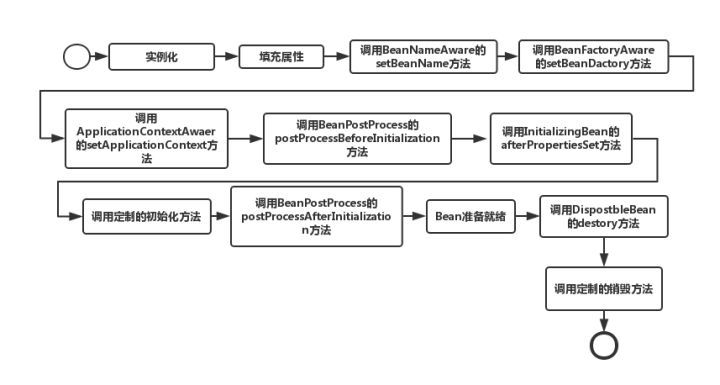

Bean默认的是单例的
>Spring中说的单例是相对于容器的，既在ApplicationContext中是单例的。而平常说的单例是相对于JVM的。另一个JVM可以有多个Spring容器，而且Spring中的单例也只是按bean的id来区分的。
Spring单例Bean与单例模式的区别在于它们关联的环境不一样，单例模式是指在一个JVM进程中仅有一个实例，而Spring单例是指一个Spring Bean容器(ApplicationContext)中仅有一个实例。

1. Bean的作用域可以通过Bean标签的scope属性进行设置，Bean的作用域包括：<br>
默认情况下scope="singleton"，那么该Bean是单例，任何人获取该Bean实例的都为同一个实例；<br>
scope="prototype"，任何一个实例都是新的实例；<br>
scope="request"，在WEB应用程序中，每一个实例的作用域都为request范围；<br>
scope="session",在WEB应用程序中，每一个实例的作用域都为session范围；<br>
> 注意：在默认情况下，Bean实例在被Spring容器初始化的时候，就会被实例化，默认调用无参数的构造方法。在其它情况下，Bean将会在获取实例的时候才会被实例化。

2. Bean可以通过指定属性init-method指定初始化后执行的方法，以及通过指定属性destroy-method销毁时执行的方法。<br>
语法：
```
<bean ....   destroy-method="销毁时调用的方法名" init-method="初始化后执行的方法名"/>
```

<table>
    <tr>
        <td>饿汉模式</td>
        <td>spring singleton的缺省是饿汉模式:启动容器时(即实例化容器时),为所有spring配置文件中定义的bean都生成一个实例</td>
    </tr>
    <tr>
      <td>懒汉模式</td>
      <td>在第一个请求时才生成一个实例,以后的请求都调用这个实例spring singleton设置为懒汉模式:&lt;beans default-lazy-init="true"&gt;</td>
    </tr>
</table>

### spring Bean生命周期:



问到Spring中Bean的生命周期，起始也就是考察一下对Spring是否熟悉，工作中很少用到其中的内容，在这里简单整理了下。PS：可以借鉴Servlet的生命周期，实例化、初始init、接收请求service、销毁destroy;

1. 实例化一个Bean，也就是我们通常说的new

2. 按照Spring上下文对实例化的Bean进行配置，也就是IOC注入

3. 如果这个Bean实现了BeanNameAware接口，会调用它实现的setBeanName(String beanId)方法，此处传递的是Spring配置文件中Bean的ID

4. 如果这个Bean实现了BeanFactoryAware接口，会调用它实现的setBeanFactory()，传递的是Spring工厂本身（可以用这个方法获取到其他Bean）

5. 如果这个Bean实现了ApplicationContextAware接口，会调用setApplicationContext(ApplicationContext)方法，传入Spring上下文，该方式同样可以实现步骤4，但比4更好，以为ApplicationContext是BeanFactory的子接口，有更多的实现方法

6. 如果这个Bean关联了BeanPostProcessor接口，将会调用postProcessBeforeInitialization(Object obj, String s)方法，BeanPostProcessor经常被用作是Bean内容的更改，并且由于这个是在Bean初始化结束时调用After方法，也可用于内存或缓存技术

7. 如果这个Bean在Spring配置文件中配置了init-method属性会自动调用其配置的初始化方法

8. 如果这个Bean关联了BeanPostProcessor接口，将会调用postAfterInitialization(Object obj, String s)方法
>注意：以上工作完成以后就可以用这个Bean了，那这个Bean是一个single的，所以一般情况下我们调用同一个ID的Bean会是在内容地址相同的实例

9. 当Bean不再需要时，会经过清理阶段，如果Bean实现了DisposableBean接口，会调用其实现的destroy方法

10. 最后，如果这个Bean的Spring配置中配置了destroy-method属性，会自动调用其配置的销毁方法

以上10步骤可以作为面试或者笔试的模板，另外我们这里描述的是应用Spring上下文Bean的生命周期，如果应用Spring的工厂也就是BeanFactory的话去掉第5步就Ok了
